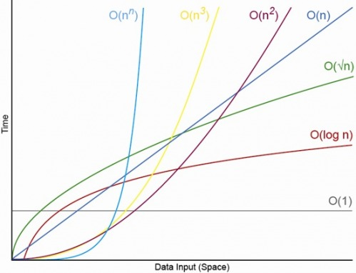

# 빅오 표기법

알고리즘이 얼마나 효율적인지는 다음과 같은 측면에서 이루어진다.

* 시간\(Runtime, 실행 시간\) 
* 공간\(Runspace, 사용된 메모리\)

빅오 표기법은 알고리즘의 최악의 경우 복잡도를 측정한다. 알고리즘의 성능을 평가하기 위해 처리해야할 데이터의 양\(n\)에 대한 실행 시간을 계산한다.




### **O\(1\) - 상수 시간\(Constant Runtime\) 복잡도**

데이터의 양과 상관없이 항상 일정한 실행 시간을 갖는 알고리즘이다. \(입력공간에 대해 변하지 않는다.\) O\(1\)의 예로 배열에 있는 항목을 인덱스로 사용해 접근하는 경우가 있다.

```javascript
function constantRuntime(n) {
  var result = n * 2;
  return result;
}
```

### **O\(n\) - 선형 시간\(Linear Runtime\) 복잡도**

처리해야할 데이터의 양에 비례하여 실행 시간도 증가하는 알고리즘이다. O\(n\)의 예로 0부터 n-1까지의 숫자를 출력하는 경우가 있다.

```javascript
function linearRuntime(n) {
  for (var i = 0; i < n; i++) {
    console.log(i);
  }
}
```

### **O\(n²\) - 2차 시간\(Quadratic Runtime\) 복잡도**

처리해야할 데이터의 양의 제곱의 시간 복잡도를 가지는 알고리즘이다. 반복문 2개가 중첩되어 있는 경우가 있다. 

```javascript
function quadraticRuntime(n) {
  for (var i = 0; i < n; i++) {
    for (var j = i; j < n; j++) {
      console.log(i * j);
    }
  }
}
```

### **O\(n³\) - 3차 시간\(Cubic Runtime\) 복잡도**

반복문이 3번 중첩되어 있는 경우의 알고리즘이다. 매우 느리다.

```javascript
function cubicRuntime(n) {
  for (var i = 0; i < n; i++) {
    for (var j = i; j < n; j++) {
      for (var k = j; k < n; k++) {
        console.log(i * j * k);
      }
    }
  }
}
```

### **O\(log\(n\)\) - 로그 시간\(Logarithmic Runtime\) 복잡도**

실행 시간의 증가폭이 log n 그래프를 가지므로 처리해야할 데이터의 양이 클 때 효율이 분명하다. 예를 들어 2의 2승부터 n승까지의 항목들을 처리하는 경우가 있다. 

```javascript
function logarithmicRuntime(n) {
  for (var i = 2; i <= n; i=i*2) {
    console.log(i);
  }
}
// logarithmicRuntime(10) => 2,4,8,16,32,64
```

```javascript
function binarySearch(arr, search) {
  var min = 0;
  var max = arr.length - 1;
  var index;
  var elem;

  while (min <= max) {
    index = Math.floor((min + max) / 2);
    elem = arr[index];

    if (elem < search) {
      min = index + 1;
    }
    else if (elem > search) {
      max = index - 1;
    }
    else {
      return index;
    }
  }

  return -1;
}
```

### **O\(n log\(n\)\) - Efficient Sorting Algorithms**

처리해야할 데이터의 양에 비해 정비례보다 약간 더 증가하는 실행 시간을 갖게 된다. 효율이 좋은 정렬 알고리즘의 성능이 이에 해당한다.

### O\(∞\) - 무한루프

함수가 종료되지 않는다.

```javascript
function infiniteRuntime(n) {
    white(true) {
        console.log(n);
    }
}
```

### 자주 사용되는 빅오 표기법 규칙

* 계수/상수 제거하기\(계수 법칙\)
* 빅오 더하기\(합의 법칙\)
* 빅오 곱하기\(곱의 법칙\)
* 루프를 조사해 빅오 표기법의 다항 결정하기\(다항 법칙\)

### 


