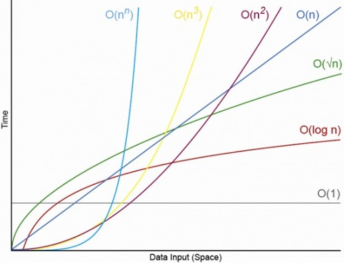

# 빅오 표기법

알고리즘이 얼마나 효율적인지는 다음과 같은 측면에서 이루어진다.

* 시간\(Runtime, 실행 시간\) 
* 공간\(Runspace, 사용된 메모리\)

빅오 표기법은 알고리즘의 최악의 경우 복잡도를 측정한다. 알고리즘의 성능을 평가하기 위해 처리해야할 데이터의 양\(n\)에 대한 실행 시간을 계산한다.




**O\(1\) - 상수 시간\(Constant Runtime\)**

An algorithm that is O\(1\), is said to be "Big O of 1" or **constant**, and does not vary depending on the size of the input. This is good. This is fast even for very large values of n.

```javascript
function constantRuntime(x) {
  var result = x * 2;
  return result;
}
```

**O\(N\) - Linear Runtime**

An algorithm that is O\(n\), is said to be "Big O of n" or **linear**, and this indicates that the resources required grow proportionally to the size of the input. This is reasonable performance.

```javascript
function linearRuntime(x) {
  for (var i = 0; i < x; i++) {
    console.log(i);
  }
}
```

**O\(n2\) - Quadratic Runtime**

An algorithm that is O\(n^2\), is said to be "Big O of n squared" or **quadratic**, and it means the resources grow in proportion to the square of the input. This is **slow**. Think of really big numbers and then think of them squared.

```javascript
function quadraticRuntime(x) {
  for (var i = 0; i < x; i++) {
    for (var j = 0; j < x; j++) {
      console.log(i * j);
    }
  }
}
```

**O\(log\(n\)\) - Logarithmic Runtime**

An algorithm that is O\(log\(n\)\), is said to be "Big O of log n" or **logarithmic**, and it means the resources grow to the inverse of exponential growth. This is **fast!** Algorithms that grow this slow are great!

Think of logarithmic algorithms as cutting the amount of work to do in half at each step of the way. Big numbers are quickly halved down to smaller and smaller numbers.

Binary search is a classic O\(log\(n\)\) algorithm.

Imagine flipping through a phone book to find someone's number. A linear O\(N\) algorithm would start at the beginning of the phone book and read every name on every page until it found the name you're looking for. This is terribly slow!

Instead of reading every single name it's much easier to read one random name and flip far forward or backward depending on how close that name is to the name you're looking for.

This only works because the phone book is sorted by names. Imagine trying to do a reverse look up on a mysterious phone number using a phone book. You'd have to start at the beginning and look at every single entry!

One million can be split in half roughly twenty times before getting down to one. Imagine looking for a name in a phone book with a million pages and see how quickly the amount of pages left to look through goes down:

1,000,000 pages left 500,000 pages left 250,000 pages left 125,000 pages left 64,000 pages left 32,000 pages left 16,000 pages left 8,000 pages left 4,000 pages left 2,000 pages left 1,000 pages left 500 pages left 250 pages left 125 pages left 64 pages left 32 pages left 16 pages left 8 pages left 4 pages left 2 pages left 1 page left

Here's an actual implementation of using binary search to look for things efficiently in an array in JavaScript:

```javascript
function binarySearch(arr, search) {
  var min = 0;
  var max = arr.length - 1;
  var index;
  var elem;

  while (min <= max) {
    index = Math.floor((min + max) / 2);
    elem = arr[index];

    if (elem < search) {
      min = index + 1;
    }
    else if (elem > search) {
      max = index - 1;
    }
    else {
      return index;
    }
  }

  return -1;
}
```

**O\(n log\(n\)\) - Efficient Sorting Algorithms**

This is another common measure of complexity. It usually appears when dealing with sorting algorithms. Think of an `n log(n)` algorithm as doing a binary search for each thing in an array. It performs an `log(n)` operation `n` times, so we multiply them together.

See the [Cheat Sheet](http://bigocheatsheet.com/) for some other common time \(processing time\) and space \(memory\) complexities and their notations.


